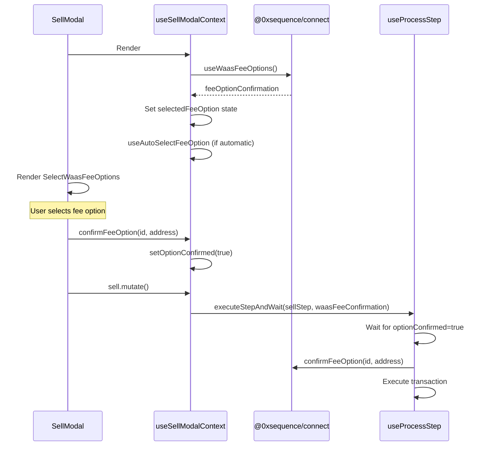

# WaaS Fee Selection Integration - Sell Modal

## Executive Summary

This document outlines how to integrate the new WaaS fee selection hooks into the Sell Modal to create a proper step-based fee selection flow.

### 💡 Key Insight

**Fee selection should be a STEP in the flow**, not something that happens during transaction execution. We can discover fee options proactively before the approval/sell steps.

### Two Implementation Approaches

#### Approach A: Proactive Fee Discovery (Recommended)
- **Create** `useDiscoverFeeOptions` hook to pre-fetch fee options
- **Use** `useRequiresFeeSelection` to enhance options with balances
- **Use** `useExecuteWithFee` to execute with selected option
- **Benefit**: Proper step flow, uses both new hooks, better UX
- **Trade-off**: Requires `estimateGas` workaround or API endpoint

#### Approach B: Just-in-Time Fee Selection (Simpler)
- **Use** `useExecuteWithFee` only
- **Remove**: Manual confirmation logic, polling
- **Benefit**: Works today, no API changes needed
- **Trade-off**: Fee selection happens during transaction, not as a step

This guide covers **BOTH approaches** with detailed implementation steps.

### What's Changing

- **Add**: Proactive fee discovery step (Approach A) OR
- **Simplify**: Fee confirmation logic (Approach B)
- **Remove**: Manual `optionConfirmed` state, polling in `useProcessStep`
- **Benefit**: Cleaner code, better UX, proper step flow

### Migration Effort

#### Approach A (Proactive)
- **Files to modify**: 5 files
- **New hook**: `useDiscoverFeeOptions`
- **Lines changed**: ~150-200 lines
- **Risk level**: Medium-High
- **Testing required**: Extensive WaaS integration tests

#### Approach B (Simplified)
- **Files to modify**: 4 files
- **Lines changed**: ~100-150 lines
- **Risk level**: Medium
- **Testing required**: WaaS wallet integration tests

---

## Overview

This document provides detailed steps to integrate the new React Query-based WaaS fee selection hook (`useExecuteWithFee`) into the Sell Modal.

## Current Architecture

### Sell Modal Structure

The Sell Modal uses a modern React pattern with:

1. **XState Store** (`internal/store.ts`)
   - Manages modal open/close state
   - Stores modal parameters (collectionAddress, chainId, tokenId, order)

2. **Context Hook** (`internal/context.ts`)
   - Main orchestration hook: `useSellModalContext()`
   - Manages multi-step flow (WaaS fee selection → approval → sell)
   - Uses React Query mutations for approve/sell actions
   - Manually manages WaaS fee state with `@0xsequence/connect`'s `useWaasFeeOptions()`

3. **Modal Component** (`Modal.tsx`)
   - Renders UI based on context state
   - Shows `SelectWaasFeeOptions` component when WaaS fee selection needed
   - Conditionally shows approve/sell buttons based on step status

4. **Mutations** (`internal/sell-mutations.ts`)
   - `approve` mutation: Executes token approval
   - `sell` mutation: Executes sell transaction
   - Both use `useProcessStep()` which handles WaaS fee confirmation

### Current WaaS Fee Flow



### Current Issues

1. **Manual State Management**: Context manages `selectedFeeOption`, `optionConfirmed`, `waasFeeSelectionError` as local state
2. **Complex Coordination**: `useProcessStep` waits for manual confirmation flag (`optionConfirmed`) before proceeding
3. **Two-phase Confirmation**: User confirms in UI, then `useProcessStep` confirms with connector
4. **Automatic Selection**: `useAutoSelectFeeOption` runs in effect with error-prone polling
5. **Balance Fetching**: Uses `useWaasFeeBalance` hook inside `SelectWaasFeeOptions` component

## New Architecture with React Query Hooks

### New Hooks Available

#### `useRequiresFeeSelection`

```typescript
const { data, isLoading } = useRequiresFeeSelection({
  chainId: number,
  options?: FeeOption[], // From transaction step
  enabled?: boolean,
});

// Returns:
// {
//   isRequired: boolean,
//   options: FeeOptionExtended[], // With balance info
//   recommendedOption: FeeOptionExtended | null,
// }
```

**Features:**
- Automatically fetches balances for all fee options
- Returns options enhanced with balance info
- Recommends best option (first with sufficient balance)
- React Query caching/refetching

#### `useExecuteWithFee`

```typescript
const { execute, isExecuting, pendingConfirmation } = useExecuteWithFee({
  chainId: number,
  onSuccess?: (data: unknown) => void,
  onError?: (error: Error) => void,
});

// Execute transaction with fee selection
execute({
  transactionFn: () => Promise<unknown>,
  selectedFeeOption: FeeOption,
});

// pendingConfirmation: WaasFeeOptionConfirmation | null
// - Set when fee confirmation is needed
// - Contains options, id, chainId
```

**Features:**
- Intercepts WaaS connector's `feeConfirmationHandler`
- Auto-confirms selected fee option when transaction starts
- Returns pending confirmation state for UI
- React Query mutation state management

## Integration Strategy

### Approach: Replace Manual WaaS State with New Hooks

**Goal**: Simplify WaaS fee management by:
1. Using `useRequiresFeeSelection` for balance-enhanced options
2. Using `useExecuteWithFee` mutation instead of manual confirmation
3. Removing local state (`selectedFeeOption`, `optionConfirmed`, etc.)
4. Removing `useAutoSelectFeeOption` (replaced by `recommendedOption`)

### Key Decisions

1. **Where to integrate**: In `internal/context.ts` (`useSellModalContext`)
   - Replace `useWaasFeeOptions()` with `useRequiresFeeSelection()`
   - Wrap `sell.mutate()` with `useExecuteWithFee()`

2. **What to remove**:
   - Local state: `selectedFeeOption`, `optionConfirmed`, `waasFeeSelectionError`
   - Effect: `useAutoSelectFeeOption()` logic
   - Manual confirmation logic in `useProcessStep`

3. **What to keep**:
   - Step-based flow (approve → sell)
   - `SelectWaasFeeOptions` UI component (with updates)
   - Transaction status modal
   - Analytics tracking

## Detailed Implementation Steps

### Step 1: Update Imports in `context.ts`

```typescript
// Remove:
import { useWaasFeeOptions } from '@0xsequence/connect';

// Add:
import { useExecuteWithFee } from '../../../../hooks/waas';
```

### Step 2: Replace `useWaasFeeOptions` with `useExecuteWithFee`

**Location**: `context.ts` lines 86-117

**Current code:**
```typescript
const [selectedFeeOption, setSelectedFeeOption] = useState<FeeOptionExtended | undefined>(undefined);
const [optionConfirmed, setOptionConfirmed] = useState(false);
const [waasFeeSelectionError, setWaasFeeSelectionError] = useState<Error | undefined>(undefined);
const [feeOptionConfirmation, confirmFeeOption, rejectFeeOption] = useWaasFeeOptions();
const autoSelectFeeOption = useAutoSelectFeeOption({
  enabled: config.waasFeeOptionSelectionType === 'automatic',
});

useEffect(() => {
  autoSelectFeeOption()
    .then((result) => {
      if (feeOptionConfirmation?.id && result.selectedOption) {
        confirmFeeOption(feeOptionConfirmation.id, result.selectedOption.token.contractAddress as string | null);
      }
    })
    .catch((error) => { /* ... */ });
}, [/* ... */]);

useEffect(() => {
  // Select first option with balance
}, [feeOptionConfirmation]);
```

**New code:**
```typescript
// Keep only selected option state (no more optionConfirmed or error)
const [selectedFeeOption, setSelectedFeeOption] = useState<FeeOptionExtended | undefined>(undefined);

// Replace useWaasFeeOptions with useExecuteWithFee
const executeWithFee = useExecuteWithFee({
  chainId: state.chainId,
  onSuccess: (data) => {
    // Will handle in sell mutation onSuccess instead
  },
  onError: (error) => {
    // Pass to callback
    state.callbacks?.onError?.(error as Error);
  },
});

// Get pending confirmation (replaces feeOptionConfirmation)
const feeOptionConfirmation = executeWithFee.pendingConfirmation;

// Auto-select first option with balance when confirmation appears
useEffect(() => {
  if (!feeOptionConfirmation) {
    return;
  }
  
  const options = feeOptionConfirmation.options as FeeOptionExtended[];
  
  // For automatic mode, use useAutoSelectFeeOption
  if (config.waasFeeOptionSelectionType === 'automatic') {
    // Keep existing auto-select logic
    autoSelectFeeOption()
      .then((result) => {
        if (result.selectedOption) {
          setSelectedFeeOption(result.selectedOption);
        }
      })
      .catch((error) => {
        console.error('Failed to auto-select fee option:', error);
      });
    return;
  }
  
  // For manual mode, select first option with balance
  const firstOptionWithBalance = options.find((o) => o.hasEnoughBalanceForFee);
  if (firstOptionWithBalance) {
    setSelectedFeeOption(firstOptionWithBalance);
  } else if (options.length > 0) {
    setSelectedFeeOption(options[0]);
  }
}, [feeOptionConfirmation, config.waasFeeOptionSelectionType]);

// Note: Keep autoSelectFeeOption hook if using automatic mode
const autoSelectFeeOption = useAutoSelectFeeOption({
  enabled: config.waasFeeOptionSelectionType === 'automatic',
});
```

### Step 3: Update Sell Mutation to Use `executeWithFee`

**Location**: `context.ts` lines 170-182 (where mutations are called)

**Current code:**
```typescript
const { approve, sell } = useSellMutations({
  tx: sellSteps.data,
  onSuccess,
  waasFeeConfirmation: isWaaS
    ? {
        feeOptionConfirmation,
        selectedOption: selectedFeeOption,
        optionConfirmed,
        confirmFeeOption,
        setOptionConfirmed,
      }
    : undefined,
});
```

**New code:**
```typescript
// Get base mutations without WaaS confirmation
const { approve, sell: baseSell } = useSellMutations({
  tx: sellSteps.data,
  onSuccess,
  waasFeeConfirmation: undefined, // Remove - now handled by useExecuteWithFee
});

// Wrap sell mutation with fee handling
const sell = {
  ...baseSell,
  mutate: () => {
    // If WaaS and has fee confirmation, use executeWithFee
    if (isWaaS && feeOptionConfirmation) {
      if (!selectedFeeOption) {
        throw new Error('No fee option selected');
      }
      
      executeWithFee.execute({
        transactionFn: () => baseSell.mutateAsync(),
        selectedFeeOption,
      });
    } else {
      // Non-WaaS or no fee confirmation needed
      baseSell.mutate();
    }
  },
  mutateAsync: async () => {
    if (isWaaS && feeOptionConfirmation) {
      if (!selectedFeeOption) {
        throw new Error('No fee option selected');
      }
      
      return executeWithFee.executeAsync({
        transactionFn: () => baseSell.mutateAsync(),
        selectedFeeOption,
      });
    }
    return baseSell.mutateAsync();
  },
  isPending: baseSell.isPending || executeWithFee.isExecuting,
  isSuccess: baseSell.isSuccess,
  isError: baseSell.isError || !!executeWithFee.error,
  error: baseSell.error || executeWithFee.error,
  status: baseSell.status,
  reset: () => {
    baseSell.reset();
    executeWithFee.mutation.reset();
  },
  data: baseSell.data,
};
```

### Step 4: Update WaaS Fee Step Generation

**Location**: `context.ts` lines 184-211

**Current code:**
```typescript
// WaaS fee selection step (if needed)
if (isWaaS && feeOptionConfirmation) {
  steps.push({
    id: 'waas-fee-selection' satisfies SellStepId,
    label: 'Select Fee Option',
    status: optionConfirmed ? 'success' : selectedFeeOption ? 'idle' : 'pending',
    isPending: !selectedFeeOption,
    isSuccess: optionConfirmed,
    isError: !!waasFeeSelectionError,
    waasFee: {
      feeOptionConfirmation: feeOptionConfirmation,
      selectedOption: selectedFeeOption,
      optionConfirmed: optionConfirmed,
      waasFeeSelectionError: waasFeeSelectionError,
      setSelectedFeeOption: setSelectedFeeOption,
      confirmFeeOption: confirmFeeOption,
      rejectFeeOption: rejectFeeOption,
      setOptionConfirmed: setOptionConfirmed,
    },
    run: () => {},
  });
}
```

**New code:**
```typescript
// WaaS fee selection step (if needed)
if (isWaaS && feeOptionConfirmation) {
  const hasSelectedOption = !!selectedFeeOption;
  const isConfirming = executeWithFee.isExecuting || baseSell.isPending;
  
  steps.push({
    id: 'waas-fee-selection' satisfies SellStepId,
    label: 'Select Fee Option',
    status: isConfirming 
      ? 'success' 
      : hasSelectedOption 
        ? 'idle' 
        : 'pending',
    isPending: !hasSelectedOption,
    isSuccess: isConfirming,
    isError: !!executeWithFee.error,
    waasFee: {
      // Simplified interface - remove confirmFeeOption, rejectFeeOption, optionConfirmed, setOptionConfirmed
      feeOptionConfirmation: feeOptionConfirmation,
      selectedOption: selectedFeeOption,
      setSelectedFeeOption: setSelectedFeeOption,
      waasFeeSelectionError: executeWithFee.error as Error | undefined,
      // These are no longer needed - useExecuteWithFee handles confirmation
      confirmFeeOption: undefined,
      rejectFeeOption: undefined,
      optionConfirmed: isConfirming,
    },
    run: () => {}, // No-op, selection happens via setSelectedFeeOption
  });
}
```

**Note**: Update `WaasFee` type to make `confirmFeeOption` and `rejectFeeOption` optional.

### Step 5: Update Modal Component Rendering

**Location**: `Modal.tsx` lines 127-163

**Current code (lines 127-163):**
```typescript
{(() => {
  const selectedOption = waasFeeStep?.waasFee.selectedOption;
  const onSelectedOptionChange = waasFeeStep?.waasFee.setSelectedFeeOption;
  const optionConfirmed = waasFeeStep?.waasFee.optionConfirmed || false;

  return ((waasFeeStep &&
    (waasFeeStep.status === 'idle' || waasFeeStep.status === 'pending')) ||
    selectedOption) &&
    waasFeeOptionSelectionType === 'manual' &&
    selectedOption &&
    onSelectedOptionChange ? (
    <SelectWaasFeeOptions
      chainId={chainId}
      feeOptionConfirmation={waasFeeStep?.waasFee.feeOptionConfirmation}
      selectedOption={selectedOption}
      onSelectedOptionChange={onSelectedOptionChange}
      onConfirm={() => {
        const feeData = waasFeeStep?.waasFee;
        const confirmationId = feeData?.feeOptionConfirmation?.id;
        const currencyAddress = feeData?.selectedOption?.token.contractAddress || null;
        if (confirmationId && feeData) {
          feeData.confirmFeeOption?.(confirmationId, currencyAddress);
          feeData.setOptionConfirmed(true);
        }
      }}
      optionConfirmed={optionConfirmed}
      titleOnConfirm="Confirming sale..."
    />
  ) : null;
})()}
```

**New code (simplified):**
```typescript
{waasFeeStep && 
  (waasFeeStep.status === 'idle' || waasFeeStep.status === 'pending') &&
  waasFeeOptionSelectionType === 'manual' ? (
  <SelectWaasFeeOptions
    chainId={chainId}
    feeOptionConfirmation={waasFeeStep.waasFee.feeOptionConfirmation}
    selectedOption={waasFeeStep.waasFee.selectedOption}
    onSelectedOptionChange={waasFeeStep.waasFee.setSelectedFeeOption}
    onConfirm={() => {
      // Confirmation now handled automatically by useExecuteWithFee
      // Just trigger the sell mutation
      sellStep?.run();
    }}
    optionConfirmed={waasFeeStep.waasFee.optionConfirmed || false}
    titleOnConfirm="Confirming sale..."
  />
) : null}
```

**Note**: The `onConfirm` logic is greatly simplified. The actual fee confirmation happens automatically in `useExecuteWithFee` when the transaction executes.

### Step 6: Remove WaaS Logic from `useProcessStep`

**Location**: `hooks/transactions/useProcessStep.ts` lines 30-90

**Current code (lines 37-71):**
```typescript
const processStep = async ({
  step,
  chainId,
  waasFeeConfirmation,
}: ProcessStepParams): Promise<ProcessStepResult> => {
  // Transaction steps - return transaction hash
  if (isTransactionStep(step)) {
    // Wait for WaaS fee confirmation if needed
    if (
      waasFeeConfirmation?.feeOptionConfirmation &&
      !waasFeeConfirmation.optionConfirmed
    ) {
      await new Promise<void>((resolve) => {
        const checkConfirmation = () => {
          if (
            waasFeeConfirmation?.selectedOption &&
            waasFeeConfirmation.optionConfirmed
          ) {
            // Confirm the fee option
            const confirmationId = waasFeeConfirmation.feeOptionConfirmation?.id;
            const currencyAddress =
              waasFeeConfirmation.selectedOption.token.contractAddress || null;

            if (!confirmationId) {
              throw new Error('Fee confirmation ID is missing');
            }

            waasFeeConfirmation.confirmFeeOption(confirmationId, currencyAddress);
            resolve();
          } else {
            // Check again in next tick
            setTimeout(checkConfirmation, 1000);
          }
        };
        checkConfirmation();
      });
    }

    const hash = await sendTransactionAsync({
      // ... transaction params
    });

    return { type: 'transaction', hash };
  }
  // ...
};
```

**New code:**
```typescript
const processStep = async ({
  step,
  chainId,
  // Remove waasFeeConfirmation parameter
}: ProcessStepParams): Promise<ProcessStepResult> => {
  // Transaction steps - return transaction hash
  if (isTransactionStep(step)) {
    // Remove entire WaaS confirmation wait logic
    // Fee confirmation is now handled by useExecuteWithFee interceptor
    
    const hash = await sendTransactionAsync({
      chainId,
      to: step.to as Hex,
      data: step.data as Hex,
      value: hexToBigInt((step.value as Hex) || '0x0'),
      ...(step.maxFeePerGas && {
        maxFeePerGas: hexToBigInt(step.maxFeePerGas as Hex),
      }),
      ...(step.maxPriorityFeePerGas && {
        maxPriorityFeePerGas: hexToBigInt(step.maxPriorityFeePerGas as Hex),
      }),
      ...(step.gas && {
        gas: hexToBigInt(step.gas as Hex),
      }),
    });

    return { type: 'transaction', hash };
  }
  // ... rest of function
};
```

**Update type definition (lines 17-21):**
```typescript
type ProcessStepParams = {
  step: Step;
  chainId: number;
  // REMOVE: waasFeeConfirmation?: WaasFeeConfirmationState;
};
```

### Step 7: Update `sell-mutations.ts` to Remove WaaS Parameter

**Location**: `internal/sell-mutations.ts` lines 14-18, 52-55, 60-63

**Current code:**
```typescript
type UseSellMutationsParams = {
  tx: ReturnType<typeof useGenerateSellTransaction>['data'];
  onSuccess?: OnSuccessCallback;
  waasFeeConfirmation?: WaasFeeConfirmationState; // REMOVE THIS
};

// ...

const approve = useMutation({
  mutationFn: async () => {
    if (!tx?.approveStep) throw new Error('No approval step available');
    return await executeStepAndWait(tx.approveStep, waasFeeConfirmation); // REMOVE SECOND PARAM
  },
  onError: (e) => state.callbacks?.onError?.(e as Error),
});

const sell = useMutation({
  mutationFn: async () => {
    if (!tx?.sellStep) throw new Error('No sell step available');
    const res = await executeStepAndWait(tx.sellStep, waasFeeConfirmation); // REMOVE SECOND PARAM
    // ...
  },
  // ...
});
```

**New code:**
```typescript
type UseSellMutationsParams = {
  tx: ReturnType<typeof useGenerateSellTransaction>['data'];
  onSuccess?: OnSuccessCallback;
  // Removed: waasFeeConfirmation?: WaasFeeConfirmationState;
};

// ...

async function executeStepAndWait(
  step: Step,
  // Removed second parameter
) {
  const res = await processStep({
    step,
    chainId: state.chainId,
    // Removed: waasFeeConfirmation
  });
  if (res.type === 'transaction' && res.hash) {
    await waitForTransactionReceipt({
      txHash: res.hash,
      chainId: state.chainId,
      sdkConfig,
    });
  }
  return res;
}

const approve = useMutation({
  mutationFn: async () => {
    if (!tx?.approveStep) throw new Error('No approval step available');
    return await executeStepAndWait(tx.approveStep);
  },
  onError: (e) => state.callbacks?.onError?.(e as Error),
});

const sell = useMutation({
  mutationFn: async () => {
    if (!tx?.sellStep) throw new Error('No sell step available');
    const res = await executeStepAndWait(tx.sellStep);
    // ... rest stays the same
  },
  // ...
});
```

### Step 8: Update Type Definitions

**Location**: `internal/context.ts` lines 22-30

**Current type:**
```typescript
export type WaasFee = Omit<
  WaasFeeConfirmationState,
  'feeOptionConfirmation'
> & {
  feeOptionConfirmation: WaasFeeOptionConfirmation;
  waasFeeSelectionError?: Error;
  setSelectedFeeOption: (option: FeeOptionExtended | undefined) => void;
  rejectFeeOption: (id: string) => void;
};
```

**New type (simplified):**
```typescript
export type WaasFee = {
  feeOptionConfirmation: WaasFeeOptionConfirmation;
  selectedOption: FeeOptionExtended | undefined;
  waasFeeSelectionError?: Error;
  setSelectedFeeOption: (option: FeeOptionExtended | undefined) => void;
  optionConfirmed: boolean;
  // Removed: confirmFeeOption, rejectFeeOption, setOptionConfirmed
};
```

## Testing Considerations

### Manual Testing

1. **Automatic mode** (`waasFeeOptionSelectionType: 'automatic'`):
   - Should auto-select recommended option
   - Should execute transaction without showing fee UI
   - Test with multiple fee options
   - Test with insufficient balance for all options

2. **Manual mode** (`waasFeeOptionSelectionType: 'manual'`):
   - Should show fee selection UI
   - Should display all options with balances
   - Should allow user to select option
   - Should disable "Accept Offer" if insufficient balance
   - Should show loading states

3. **Edge cases**:
   - Only one fee option (should skip selection UI)
   - No balance for any option (should show error)
   - Balance loading state
   - Testnet (may skip fees entirely)

### Unit Tests to Add

1. **context.ts**:
   - Test step generation with/without WaaS
   - Test auto-selection of recommended option
   - Test manual selection mode
   - Test error handling

2. **Integration tests**:
   - Full flow: open modal → select fee → approve → sell
   - Test transaction success/error paths
   - Test modal close/cleanup

## Migration Checklist

### Code Changes

- [ ] **Step 1**: Update imports in `internal/context.ts`
  - [ ] Remove `import { useWaasFeeOptions } from '@0xsequence/connect'`
  - [ ] Add `import { useExecuteWithFee } from '../../../../hooks/waas'`

- [ ] **Step 2**: Replace WaaS hooks in `internal/context.ts` (lines 86-136)
  - [ ] Remove `useWaasFeeOptions()` call
  - [ ] Remove `optionConfirmed` and `waasFeeSelectionError` state
  - [ ] Add `useExecuteWithFee()` call
  - [ ] Update fee option selection effects
  - [ ] Use `executeWithFee.pendingConfirmation` instead of `feeOptionConfirmation`

- [ ] **Step 3**: Update sell mutation wrapper in `internal/context.ts` (lines 170-182)
  - [ ] Wrap `sell.mutate()` to use `executeWithFee.execute()`
  - [ ] Update `isPending`, `isError`, `error` computed properties
  - [ ] Remove `waasFeeConfirmation` from `useSellMutations` call

- [ ] **Step 4**: Update WaaS fee step generation in `internal/context.ts` (lines 186-211)
  - [ ] Update step status based on `executeWithFee.isExecuting`
  - [ ] Simplify `waasFee` object (remove confirmFeeOption, etc.)
  - [ ] Update `optionConfirmed` to use `isConfirming` flag

- [ ] **Step 5**: Simplify modal rendering in `Modal.tsx` (lines 127-163)
  - [ ] Simplify conditional logic
  - [ ] Update `onConfirm` to call `sellStep?.run()` instead of manual confirmation
  - [ ] Remove manual confirmation ID and currency address logic

- [ ] **Step 6**: Update `hooks/transactions/useProcessStep.ts`
  - [ ] Remove `waasFeeConfirmation` parameter from `ProcessStepParams` type (line 20)
  - [ ] Remove entire WaaS confirmation wait logic (lines 37-71)
  - [ ] Keep only transaction execution logic

- [ ] **Step 7**: Update `internal/sell-mutations.ts`
  - [ ] Remove `waasFeeConfirmation` from `UseSellMutationsParams` type (line 17)
  - [ ] Remove second parameter from `executeStepAndWait` function (line 36)
  - [ ] Remove `waasFeeConfirmation` from `processStep` calls (lines 38, 55, 63)

- [ ] **Step 8**: Update type definitions in `internal/context.ts`
  - [ ] Simplify `WaasFee` type (lines 22-30)
  - [ ] Remove `confirmFeeOption`, `rejectFeeOption`, `setOptionConfirmed`
  - [ ] Keep only necessary properties

- [ ] **Step 9**: Update cleanup logic in `internal/context.ts` (lines 271-285)
  - [ ] Remove `rejectFeeOption` call
  - [ ] Remove fee option state cleanup (now handled by useExecuteWithFee)
  - [ ] Add `executeWithFee.mutation.reset()` if needed

### Testing

- [ ] **Unit Tests**
  - [ ] Test `useSellModalContext` with WaaS wallet
  - [ ] Test automatic fee selection mode
  - [ ] Test manual fee selection mode
  - [ ] Test error handling in `useExecuteWithFee`

- [ ] **Integration Tests**
  - [ ] Test full sell flow: open → select fee → approve → sell
  - [ ] Test with sufficient balance
  - [ ] Test with insufficient balance
  - [ ] Test with only one fee option
  - [ ] Test cancellation/modal close during fee selection

- [ ] **Manual Testing**
  - [ ] Test in playground with WaaS wallet
  - [ ] Test automatic mode (`waasFeeOptionSelectionType: 'automatic'`)
  - [ ] Test manual mode (`waasFeeOptionSelectionType: 'manual'`)
  - [ ] Test approval + sell flow
  - [ ] Test sell-only flow (no approval needed)
  - [ ] Test on mainnet and testnet
  - [ ] Test error scenarios (rejected transaction, network errors)
  - [ ] Test multiple fee options
  - [ ] Test with different fee tokens

### Cleanup

- [ ] Remove unused imports
  - [ ] `useWaasFeeOptions` from all files
  - [ ] `WaasFeeConfirmationState` type if no longer used elsewhere

- [ ] Update documentation
  - [ ] Add JSDoc comments to new code
  - [ ] Update inline comments
  - [ ] Document the new pattern for other modal implementations

- [ ] Consider follow-up refactors
  - [ ] Apply same pattern to `useCancelOrder` hook
  - [ ] Apply to BuyModal if it uses WaaS fees
  - [ ] Apply to TransferModal (already partially uses new pattern)
  - [ ] Consider deprecating `useAutoSelectFeeOption` in favor of integrated logic

## Benefits of New Approach

1. **Simplified State Management**:
   - ✅ No manual `optionConfirmed` flag
   - ✅ No polling loop in `useProcessStep`
   - ✅ Automatic confirmation when transaction executes
   - ✅ Single source of truth for pending confirmation state

2. **Better Developer Experience**:
   - ✅ Cleaner code with less boilerplate
   - ✅ Interceptor pattern handles fee confirmation automatically
   - ✅ No need to manually coordinate between UI and connector
   - ✅ Easier to understand flow

3. **More Maintainable**:
   - ✅ Fewer state variables to track
   - ✅ Less coupling between components
   - ✅ Reusable `useExecuteWithFee` hook for other modals
   - ✅ Clearer separation between UI and transaction logic

4. **Consistent with Modern React Patterns**:
   - ✅ Uses React Query mutations
   - ✅ Hooks encapsulate complex logic
   - ✅ Declarative rather than imperative

## What We're NOT Doing (And Why)

### Not Using `useRequiresFeeSelection`

**Why**: Fee options are provided dynamically by the WaaS connector when a transaction starts, not upfront. The `useRequiresFeeSelection` hook is designed for scenarios where:
- Fee options are known before transaction execution
- You want to pre-fetch balances and show UI before starting transaction
- You have an API that provides fee options separately

**Current Sell Modal flow**: Fee options only appear when `sendTransaction()` is called and the WaaS connector determines which tokens can pay fees.

**Possible future enhancement**: If the Sequence API adds an endpoint to pre-calculate fee options for a transaction, we could then:
1. Call API to get fee options
2. Use `useRequiresFeeSelection` to enhance with balances
3. Show fee UI before transaction starts
4. Use `useExecuteWithFee` to execute with selected option

### Not Pre-fetching Balances Separately

**Why**: `useWaasFeeBalance` hook inside `SelectWaasFeeOptions` component already fetches balances. Since we can't know the fee options ahead of time, we can't pre-fetch balances either.

**Current approach**: Keep `useWaasFeeBalance` in the component for now. It fetches balances when fee options become available.

**Future enhancement**: If we pre-fetch fee options (see above), we could use `useRequiresFeeSelection` which includes balance fetching.

## Key Insight: Fee Selection as a Step

### The Problem with Current Approach

The current code already has a "waas-fee-selection" step, but it has a chicken-and-egg problem:

1. Fee options only appear when `sendTransaction()` is called (connector analyzes the transaction)
2. But we can't call `sendTransaction()` until the user selects a fee option
3. Result: The fee step never gets options to display!

### The Solution: Proactive Fee Discovery

**We don't need fee options at modal open time** - we just need them **before the approval/sell steps execute**. We can fetch them as part of the step flow:

```
┌─────────────────────────────────────┐
│ Modal Opens                         │
│ - Fetch transaction steps           │
│ - Transaction details ready         │
└─────────────────────────────────────┘
              ↓
┌─────────────────────────────────────┐
│ Step 1: Fee Discovery (WaaS only)  │
│ - Trigger estimateGas on tx         │
│ - Connector provides fee options    │
│ - Fetch balances for each option    │
│ - Show fee selection UI             │
│ - User selects (or auto-select)     │
└─────────────────────────────────────┘
              ↓
┌─────────────────────────────────────┐
│ Step 2: Approval (if needed)       │
│ - Execute with selected fee option  │
└─────────────────────────────────────┘
              ↓
┌─────────────────────────────────────┐
│ Step 3: Sell                        │
│ - Execute with selected fee option  │
└─────────────────────────────────────┘
```

### How Fee Options Work

Fee options do NOT come from the transaction API. They come from the WaaS connector when a transaction is attempted:

1. App calls `sendTransaction()` or `estimateGas()`
2. WaaS connector analyzes the transaction
3. Connector determines which tokens can pay for gas
4. Connector calls the registered `feeConfirmationHandler`
5. Handler receives array of fee options
6. Handler must return the selected token address

**Key insight**: We can use `estimateGas()` to trigger fee discovery WITHOUT executing the transaction!

## Two Implementation Approaches

### Approach A: Proactive Fee Discovery (Recommended) 🌟

Create a proper fee selection step BEFORE transaction execution.

**New hook: `useDiscoverFeeOptions`**
```typescript
const { feeOptions, isDiscovering } = useDiscoverFeeOptions({
  chainId,
  transaction: sellStep,
  enabled: isWaaS && !!sellStep,
});
```

**How it works:**
1. Calls `estimateGas()` on the transaction (doesn't execute it)
2. WaaS connector triggers fee handler with options
3. Hook captures options and makes them available
4. Cancel the estimation (we only wanted the options)

**Then use both new hooks:**
```typescript
// 1. Enhance options with balance info
const feeSelection = useRequiresFeeSelection({
  chainId,
  options: feeOptions,
  enabled: !!feeOptions,
});

// 2. Execute transaction with selected option
const { execute } = useExecuteWithFee({
  chainId,
  onSuccess: () => {},
});
```

**Benefits:**
- ✅ Proper step flow (fee selection → approval → sell)
- ✅ Uses both new hooks as intended
- ✅ Better UX (user sees all steps upfront)
- ✅ Can show balance warnings before transaction
- ✅ Replaces `useAutoSelectFeeOption` with `recommendedOption`

**Trade-offs:**
- Requires new `useDiscoverFeeOptions` hook
- Uses `estimateGas` workaround (or needs API endpoint)
- More complex implementation

### Approach B: Just-in-Time Selection (Simpler) ⚡

Simplify the existing flow by only using `useExecuteWithFee`.

**How it works:**
1. Remove `useWaasFeeOptions()` 
2. Use `useExecuteWithFee` to intercept fee handler during transaction
3. Fee options appear when transaction starts
4. Simplified confirmation (no manual state management)

**Benefits:**
- ✅ Works today (no backend changes)
- ✅ Simpler implementation (~50 lines removed)
- ✅ No `optionConfirmed` state or polling
- ✅ Automatic fee confirmation

**Trade-offs:**
- Fee UI appears during transaction (not as a separate step)
- Cannot use `useRequiresFeeSelection`
- Less predictable UX (user doesn't see fee step upfront)

## Revised Integration Strategy

Given the above insight, we need a different approach:

### Option A: Keep Existing Pattern, Simplify with `useExecuteWithFee`

**Do NOT use `useRequiresFeeSelection`** - it requires fee options upfront which we don't have.

Instead, **only use `useExecuteWithFee`** to simplify the confirmation flow:

1. Remove manual state (`optionConfirmed`, polling logic)
2. Use `useExecuteWithFee.pendingConfirmation` instead of `useWaasFeeOptions`
3. Keep `SelectWaasFeeOptions` UI component
4. Let `useExecuteWithFee` handle the interceptor logic

### Option B: Pre-fetch Fee Options (Requires API Changes)

To use `useRequiresFeeSelection`, we would need:

1. Add a new API endpoint to get fee options for a transaction WITHOUT executing it
2. Include fee options in the `Step` type from `generateSellTransaction`
3. Then use both hooks as originally planned

**This is out of scope for current integration.**

## Simplified Integration Plan

Since we cannot pre-fetch fee options, here's the simplified plan:

### Phase 1: Replace `useWaasFeeOptions` with `useExecuteWithFee`

**Goal**: Use the new hook's interceptor instead of `@0xsequence/connect`'s hook.

**In `context.ts`:**

```typescript
// Remove this:
const [feeOptionConfirmation, confirmFeeOption, rejectFeeOption] = useWaasFeeOptions();

// Add this:
import { useExecuteWithFee } from '../../../../hooks/waas';

const executeWithFee = useExecuteWithFee({
  chainId: state.chainId,
  onSuccess: (data) => {
    // Handle success
  },
  onError: (error) => {
    state.callbacks?.onError?.(error);
  },
});

// Use executeWithFee.pendingConfirmation instead of feeOptionConfirmation
const feeOptionConfirmation = executeWithFee.pendingConfirmation;
```

### Phase 2: Update Sell Mutation to Use `executeWithFee`

**In `context.ts`:**

```typescript
// Wrap the sell mutation
const sell = {
  ...baseSell,
  mutate: () => {
    if (!selectedFeeOption && feeOptionConfirmation) {
      throw new Error('No fee option selected');
    }
    
    executeWithFee.execute({
      transactionFn: () => baseSell.mutateAsync(),
      selectedFeeOption: selectedFeeOption!,
    });
  },
  isPending: baseSell.isPending || executeWithFee.isExecuting,
  isSuccess: baseSell.isSuccess,
  error: baseSell.error || executeWithFee.error,
};
```

### Phase 3: Remove Manual Confirmation Logic

**Remove from `context.ts`:**
- `setOptionConfirmed` state
- `confirmFeeOption` calls (handled by `useExecuteWithFee`)
- Polling logic in `useProcessStep`

**Remove from `sell-mutations.ts`:**
- `waasFeeConfirmation` parameter

**Remove from `useProcessStep.ts`:**
- Entire manual confirmation wait logic (lines 37-71)

### Benefits of This Approach

1. ✅ **Simpler**: Only one new hook to integrate
2. ✅ **No API changes needed**: Works with existing transaction flow
3. ✅ **Cleaner state**: No manual confirmation flags
4. ✅ **Better UX**: Automatic confirmation when option selected
5. ✅ **Reusable**: Can apply same pattern to other modals

### Open Questions (Updated)

1. **Approval step fees?**
   - Should approval also use `useExecuteWithFee`?
   - Currently approval doesn't pass `waasFeeConfirmation`
   - Answer: Test if approval transactions require fees

2. **Automatic mode?**
   - How to handle automatic fee selection?
   - Answer: Use `useAutoSelectFeeOption` result to auto-call `executeWithFee.execute()`

3. **Balance display?**
   - Still need to fetch balances for UI
   - Answer: Keep `useWaasFeeBalance` in `SelectWaasFeeOptions` component for now
   - OR: Use `useRequiresFeeSelection` only for balance fetching when `pendingConfirmation` available

4. **Testnet behavior?**
   - Should testnet skip fee selection entirely?
   - Answer: WaaS connector should handle this automatically

## Quick Reference: Before and After

### Before (Current Implementation)

```typescript
// In context.ts
const [feeOptionConfirmation, confirmFeeOption, rejectFeeOption] = useWaasFeeOptions();
const [optionConfirmed, setOptionConfirmed] = useState(false);

// In Modal.tsx
onConfirm={() => {
  const confirmationId = feeData?.feeOptionConfirmation?.id;
  const currencyAddress = feeData?.selectedOption?.token.contractAddress || null;
  if (confirmationId && feeData) {
    feeData.confirmFeeOption?.(confirmationId, currencyAddress);
    feeData.setOptionConfirmed(true);
  }
}}

// In useProcessStep.ts
if (waasFeeConfirmation?.feeOptionConfirmation && !waasFeeConfirmation.optionConfirmed) {
  await new Promise<void>((resolve) => {
    const checkConfirmation = () => {
      if (waasFeeConfirmation?.selectedOption && waasFeeConfirmation.optionConfirmed) {
        waasFeeConfirmation.confirmFeeOption(confirmationId, currencyAddress);
        resolve();
      } else {
        setTimeout(checkConfirmation, 1000);
      }
    };
    checkConfirmation();
  });
}
```

### After (New Implementation)

```typescript
// In context.ts
const executeWithFee = useExecuteWithFee({
  chainId: state.chainId,
  onSuccess: (data) => { /* ... */ },
  onError: (error) => { /* ... */ },
});

const feeOptionConfirmation = executeWithFee.pendingConfirmation;

// Wrap sell mutation
const sell = {
  ...baseSell,
  mutate: () => {
    if (isWaaS && feeOptionConfirmation) {
      executeWithFee.execute({
        transactionFn: () => baseSell.mutateAsync(),
        selectedFeeOption: selectedFeeOption!,
      });
    } else {
      baseSell.mutate();
    }
  },
};

// In Modal.tsx
onConfirm={() => {
  // Just trigger the sell
  sellStep?.run();
}}

// In useProcessStep.ts
// All WaaS logic removed! Just execute transaction:
const hash = await sendTransactionAsync({ /* ... */ });
```

**Key Difference**: The interceptor in `useExecuteWithFee` automatically handles fee confirmation when the transaction executes. No more manual coordination needed!

## Next Steps

1. ✅ **Documentation complete** - This guide provides all necessary steps
2. **Create implementation PR**
   - Branch name: `feat/waas-fee-integration-sell-modal`
   - Follow the 9 steps in the Migration Checklist
   - Start with Step 1-3 (context changes) as POC
3. **Test in playground** with real WaaS wallet
   - Test both automatic and manual modes
   - Test with multiple fee options
   - Test error scenarios
4. **Review and iterate**
5. **Apply pattern to other modals** (CancelOrder, Transfer, etc.)
6. **Future enhancement**: Add API endpoint to pre-fetch fee options, then integrate `useRequiresFeeSelection`

## Related Files

- **New hooks**: 
  - `sdk/src/react/hooks/waas/useExecuteWithFee.tsx`
  - `sdk/src/react/hooks/waas/useRequiresFeeSelection.tsx` (not used yet)
  
- **Files to modify**:
  - `sdk/src/react/ui/modals/SellModal/internal/context.ts`
  - `sdk/src/react/ui/modals/SellModal/internal/sell-mutations.ts`
  - `sdk/src/react/ui/modals/SellModal/Modal.tsx`
  - `sdk/src/react/hooks/transactions/useProcessStep.ts`

- **Related patterns**:
  - `sdk/src/react/hooks/transactions/useCancelOrder.tsx` (similar WaaS usage)
  - `sdk/src/react/ui/modals/TransferModal/_views/enterWalletAddress/useHandleTransfer.tsx` (another WaaS usage)

## Questions or Issues?

If you encounter issues during implementation:
1. Check the WaaS connector setup in playground
2. Verify `sequenceWaasProvider` is available on connector
3. Test with console logs in the interceptor
4. Compare with the "Before and After" code examples above
